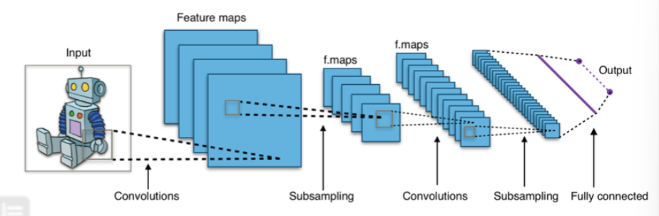
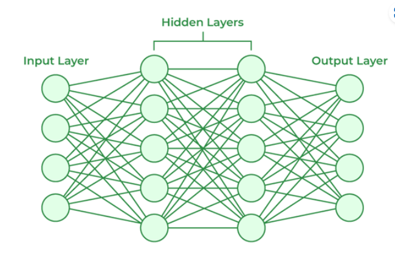
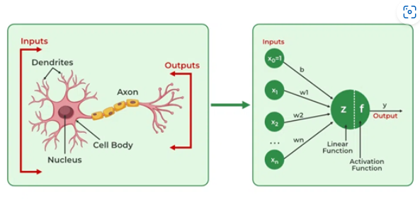

Báo Cáo Cuối Kì

Nguyễn Tiến Thành - 20215243

Báo cáo thuật toán Machine Learning & Deep Learning

I. Giới thiệu Machine Leaning & Deep Learning

II. Thuật toán Machine Learning cơ bản

III. Thuật toán Deep Learning cơ bản

I. Sơ lược về Machine Learning & Deep Learning

Học máy (ML) là một nhánh của AI cho phép máy tính học từ dữ liệu và cải thiện hiệu suất thực hiện một nhiệm vụ theo thời gian mà không cần lập trình rõ ràng.

Học máy gồm các loại: 

Học có giám sát: Thuật toán được huấn luyện trên tập dữ liệu được gắn nhãn, trong đó dữ liệu đầu vào được ghép nối với các nhãn đầu ra tương ứng. Mô hình học cách ánh xạ đầu vào thành đầu ra.

Học không giám sát: Thuật toán được cung cấp dữ liệu không được gắn nhãn và phải tự tìm các mẫu hoặc cấu trúc.

Học bán giám sát: Thuật toán được cung cấp với 1 nửa lượng dữ liệu có gán nhãn và 1 nửa không gán nhãn được dùng cho việc huấn luyện.

Học tăng cường: Mô hình học thông qua thử và sai bằng cách tương tác với môi trường và nhận phản hồi.

Các ứng dụng của machine learning gồm có phân loại, hồi quy, phân cụm, ...

Học sâu (DL): là một tập hợp con của học máy bao gồm các mạng lưới thần kinh có nhiều lớp (mạng lưới thần kinh sâu). Các mạng này có khả năng học các biểu diễn phân cấp phức tạp từ dữ liệu.

II. Thuật toán Machine Learning

1. KNN

K-nearest neighbor là thuật toán supervised-learning. Khi training, thuật toán này không học một điều gì từ dữ liệu training (lazy learning), mọi tính toán được thực hiện khi nó cần dự đoán kết quả của dữ liệu mới. 

Với KNN, trong bài toán Classification, label của một điểm dữ liệu mới được suy ra trực tiếp từ K điểm dữ liệu gần nhất trong training set. Label của một test data có thể được quyết định bằng major voting (bầu chọn theo số phiếu) giữa các điểm gần nhất, hoặc nó có thể được suy ra bằng cách đánh trọng số khác nhau cho mỗi trong các điểm gần nhất đó rồi suy ra label.

Trong bài toán Regresssion, đầu ra của một điểm dữ liệu sẽ bằng chính đầu ra của điểm dữ liệu đã biết gần nhất (trong trường hợp K=1), hoặc là trung bình có trọng số của đầu ra của những điểm gần nhất, hoặc bằng một mối quan hệ dựa trên khoảng cách tới các điểm gần nhất đó.
 
KNN là thuật toán đi tìm đầu ra của một điểm dữ liệu mới bằng cách chỉ dựa trên thông tin của K điểm dữ liệu trong training set gần nó nhất (K-lân cận), không quan tâm đến việc có một vài điểm dữ liệu trong những điểm gần nhất này là nhiễu.

Về ưu điểm của KNN,thuật toán có độ phức tạp tính toán của quá trình training là bằng 0, việc dự đoán kết quả của dữ liệu mới rất đơn giản.

Về nhược điểm, KNN rất nhạy cảm với nhiễu khi K nhỏ. Với K càng lớn thì độ phức tạp cũng sẽ tăng lên. Ngoài ra, việc lưu toàn bộ dữ liệu trong bộ nhớ cũng ảnh hưởng tới hiệu năng của KNN.

2. K-means Clustering

Phân cụm K-mean là một kỹ thuật phân vùng trong học máy không giám sát nhằm mục đích nhóm các điểm dữ liệu tương tự vào các cụm mong muốn. Tập dữ liệu gồm các mục, với các tính năng nhất định.K-mean được dùng dể phân loại các mục đó thành các nhóm. 

Thuật toán sẽ phân loại các mục thành k nhóm hoặc cụm tương tự. Để tính toán sự tương đồng đó, khoảng cách Euclide sẽ được sử dụng để làm thước đo.

Các thuật toán hoạt động như sau:

- Đầu tiên, ta khởi tạo ngẫu nhiên k điểm (tâm cụm).

- Phân loại từng mục theo giá trị trung bình gần nhất của nó và cập nhật tọa độ của giá trị trung bình, là mức trung bình của các mục được phân loại trong cụm đó cho đến nay.

- Lặp lại quy trình với số lần lặp nhất định và cuối cùng, ta có các phân loại các cụm

K-means có nhiều ưu điểm như: có khả năng mở rộng, linh hoạt và có khả năng ứng dụng vào dữ liệu số

Tuy nhiên, K-means đòi hỏi số phân cụm biết trước (rất khó trong thực tế) dẫn đến sự không tối ưu với K

III. Thuật toán deep-learning

1. CNN

CNN là một loại mạng nơ-ron nhân tạo được sử dụng rộng rãi trong xử lý hình ảnh và dữ liệu dạng lưới khác. CNNs được thiết kế để tự động học và nhận diện các đặc trưng từ dữ liệu đầu vào mà không cần sự can thiệp của con người.

COnvolutional trong CNN là một cửa sổ trượt trên ma trận:

Các convolutional layer có các parameter(kernel) đã được học để tự điều chỉnh lấy ra những thông tin chính xác nhất mà không cần chọn các feature.

- Cấu trúc mạng CNN

Mạng CNN là một tập hợp các lớp Convolution chồng lên nhau và sử dụng các hàm nonlinear activation như ReLU và tanh để kích hoạt các trọng số trong các node. Mỗi một lớp sau khi thông qua các hàm kích hoạt sẽ tạo ra các thông tin trừu tượng hơn cho các lớp tiếp theo.

Mỗi một lớp sau khi thông qua các hàm kích hoạt sẽ tạo ra các thông tin trừu tượng hơn cho các lớp tiếp theo. Trong mô hình mạng truyền ngược (feedforward neural network) thì mỗi neural đầu vào (input node) cho mỗi neural đầu ra trong các lớp tiếp theo. Các layer liên kết với nhau thông qua cơ chế convolution. Layer tiếp theo là kết quả convolution từ layer trước đó

Cách chọn tham số CNN

- Số các convolution layer: càng nhiều các convolution layer thì performance càng được cải thiện. Sau khoảng 3 hoặc 4 layer, các tác động được giảm một cách đáng kể

- Filter size: thường filter theo size 5×5 hoặc 3×3

- Pooling size: thường là 2×2 hoặc 4×4 cho ảnh đầu vào lớn
 
CNN được sử dụng cho việc nhận diện và phân loại hình ảnh, xử lí ngôn ngữ tự nhiên và âm thanh, etc.

2. ANN

ANN chứa các nơ-ron nhân tạo được gọi là các đơn vị. Các đơn vị này được sắp xếp thành một loạt các lớp cùng nhau tạo thành toàn bộ Mạng lưới thần kinh nhân tạo trong một hệ thống. Một lớp chỉ có thể có hàng chục đơn vị hoặc hàng triệu đơn vị vì điều này phụ thuộc vào cách các mạng thần kinh phức tạp sẽ được yêu cầu để tìm hiểu các mẫu ẩn trong tập dữ liệu.

ANN có lớp đầu vào, lớp đầu ra cũng như các lớp ẩn. Lớp đầu vào nhận dữ liệu từ thế giới bên ngoài mà mạng lưới thần kinh cần phân tích hoặc tìm hiểu. Sau đó, dữ liệu này đi qua một hoặc nhiều lớp ẩn để chuyển đổi đầu vào thành dữ liệu có giá trị cho lớp đầu ra. Cuối cùng, lớp đầu ra cung cấp đầu ra dưới dạng phản hồi của Mạng thần kinh nhân tạo đối với dữ liệu đầu vào được cung cấp.

Trong phần lớn các mạng lưới thần kinh, các đơn vị được kết nối với nhau từ lớp này sang lớp khác. Mỗi kết nối này có trọng số xác định ảnh hưởng của đơn vị này đến đơn vị khác. Khi dữ liệu được truyền từ đơn vị này sang đơn vị khác, mạng nơron sẽ tìm hiểu ngày càng nhiều về dữ liệu và cuối cùng sẽ tạo ra đầu ra từ lớp đầu ra.

Lớp đầu vào của mạng nơ ron nhân tạo là lớp đầu tiên, nó nhận đầu vào từ các nguồn bên ngoài và giải phóng nó đến lớp ẩn, là lớp thứ hai. Trong lớp ẩn, mỗi nơ-ron nhận đầu vào từ các nơ-ron lớp trước, tính tổng có trọng số và gửi nó đến các nơ-ron ở lớp tiếp theo. Các kết nối này được tính trọng số nghĩa là hiệu ứng của các đầu vào từ lớp trước được tối ưu hóa ít nhiều bằng cách gán các trọng số khác nhau cho từng đầu vào và nó được điều chỉnh trong quá trình đào tạo bằng cách tối ưu hóa các trọng số này để cải thiện hiệu suất mô hình.

Các loại mạng thần kinh nhân tạo gồm có: 

• Mạng nơ-ron Feedforward

• Mạng nơ-ron tích chập

• Mạng thần kinh tái phát

ANN được sử dụng trong việc xử lí ảnh và video, xử lí ngôn ngữ tự nhiên, các mô hình dự đoán và học máy tăng cường.